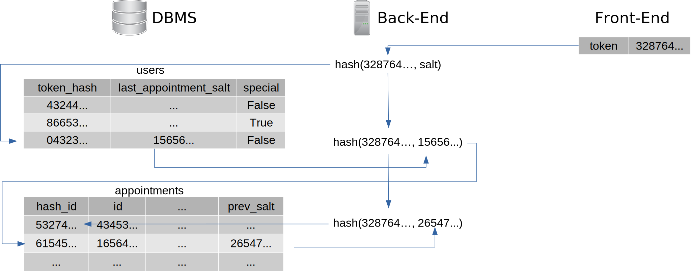

# Datenmodell zur Speicherung von Terminen

## Problem
Wenn die Termine eines Nutzers auf mehreren Geräten abrufbar und aktualisierbar sein sollen, müssen zwangsläufig Verknüpfungen zwischen Nutzer und den dazugehörigen Terminen in der Datenbank hinterlegt sein.
Diese Informationen werden auch für die Beschränkung der Anzahl an zukünftigen Terminen pro Nutzer benötigt.
Auch wenn die Nutzer/Geräte/Sessions anhand eines zufällig generierten Tokens und somit ohne direkten Personenbezug identifiziert werden, lassen sich über die Zuordnung mehrerer Termine im Falle eines Datendiebstahls o.ä. von Dritten Rückschlüsse über einzelne Nutzer ziehen, was die Anonymität bricht und somit den Datenschutz untergräbt.

## Idee 1
Die Geräte synchronisieren sich untereinander, was durch ein globales Peer-to-Peer-Netzwerk ermöglicht wird.
Hier wird keine zentrale Datenbank für diese Zuordnung benötigt.
Leider kann so nicht die Terminanzahl pro Nutzer serverseitig begrenzt werden.
Zumindest ist mir nichts dazu eingefallen.
Außerdem kann der Datenabgleich nur stattfinden, wenn dabei alle Geräte gleichzeitig online sind.

## Idee 2
Die Termindaten werden so gespeichert, dass die Zuordnung zum Nutzer mit Hilfe des Datenbestandes alleine nicht möglich ist.
Sie kann nur während der Bearbeitung der Anfragen, die vom Nutzergerät stammen, rekonstruiert werden.

Das funktioniert, indem die Referenzen zu den Terminen aus dem Token des Front-Ends mittels einer kryptographischen Hashfunktion berechnet werden.
Der Token wird bei jeder Anfrage übertragen aber nicht gespeichert (nur als Hash für die Überprüfung).
In der `users`-Tabelle ist ein zufällig generierter Salt hinterlegt, welcher zusammen mit dem Token gehasht wird.
Das Ergebnis verweist auf den zuletzt hinzugefügten Termin des Nutzers über die Spalte `hash_id`.
Dieser Termin enthält wiederum einen Salt (`prev_salt`), welcher sich auf die gleiche Weise zum vorhergehenden Termin auflösen lässt.
Somit kann das Front-End die Daten aller Termine des Nutzers vom Back-End-Server abfragen.

Eine solche rückwärts verlinkte Liste hat den Vorteil, dass die aktuell interessanten Termine direkt als erstes rekonstruiert werden können. Es muss nicht vom ältesten Termin aus iteriert werden. Außerdem kann so die Datenbank von alten Daten bereinigt werden, ohne die Referenzen zu zerstören.

Die Spalte `id` enthält eine feste Identifikationsnummer, welche sich nicht durch das Anhängen von Terminen verändert. Diese eignet sich für den QR-Code/Zauberwort.

Der Nachteil dieser Idee ist die schlechtere Performanz, da für jede Einfüge- und Lese-Operation (Auflistung) mehrere Datenbankenabfragen nötig sind.
Das Betrifft aber nur Nutzer-spezifische Anfragen.
Auslastungsberechnungen werden dadurch nicht beeinflusst.
